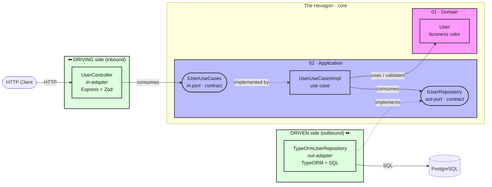
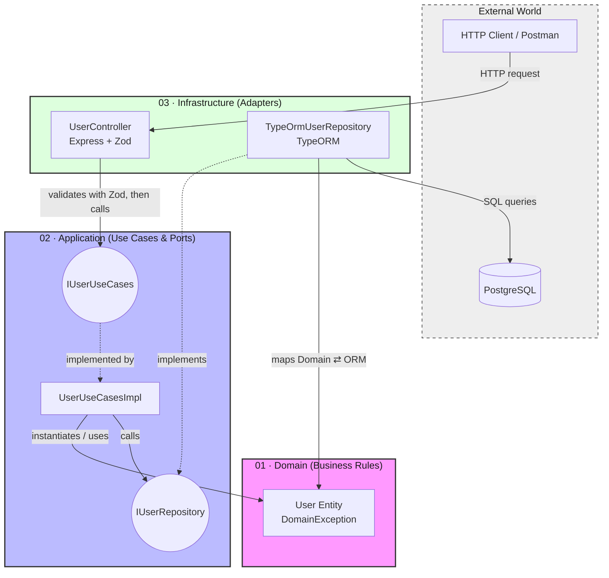

  <h1>🧭 Architecture & Diagrams</h1>
  
A didactic walkthrough of the Hexagonal Architecture (Ports &amp; Adapters) used in this project.

 

This document explains **how the pieces fit together** and **why**. If you only remember one sentence, make it this one:

> The **core** (Domain + Application) knows nothing about the outside world. The outside world plugs into the core through **ports** (contracts), and every concrete technology is an **adapter** that fits a port.

---

## 1. The big picture — Ports & Adapters

This is the conceptual map of the whole system. The hexagon is the **core**; everything outside it is a replaceable detail.

### How to read it

- **Port** (`(["rounded"])`) = a **contract** (a TypeScript `interface`). It declares the **WHAT**, never the **HOW**. A port does no work.
- **Adapter** (`["box"]`) = a **concrete class** that fits a port and does the work, translating between a technology and the contract.
- **Ports live inside the core** (Application layer); **adapters live outside** (Infrastructure).

### The asymmetry that trips everyone up

Notice the two ports behave in **opposite** ways:

| Side | Adapter | Port | Who **implements** the port | Who **consumes** it |
|------|---------|------|------------------------------|----------------------|
| **Driving** (inbound) | `UserController` | `IUserUseCases` (in-port) | the **use case** (core) | the **adapter** (controller) |
| **Driven** (outbound) | `TypeOrmUserRepository` | `IUserRepository` (out-port) | the **adapter** (repository) | the **use case** (core) |

The rule *"the adapter implements the port"* is **only true on the driven side**. On the driving side it is reversed: the adapter **consumes** the port, and the **core implements it**.

> 🔑 **Unifying rule:** the use case is always on the core's side — it **implements** the in-port and **consumes** the out-port. The adapter always does the opposite.

---

## 2. The detailed flow — request to persistence

This diagram zooms into the actual request lifecycle (`POST /users` and friends).

### Reading the flow

1. The **client** sends an HTTP request.
2. `UserController` (**in-adapter**) validates the HTTP shape with **Zod**, then calls the **in-port** `IUserUseCases`. It never lets a `Request` or a `ZodError` leak inward.
3. `UserUseCasesImpl` (**use case**) orchestrates: it builds/uses the `User` **domain entity** (which self-validates business rules) and calls the **out-port** `IUserRepository`.
4. `TypeOrmUserRepository` (**out-adapter**) implements that out-port, **maps** the domain `User` to/from `UserOrmEntity`, and runs the **SQL**.

> ✅ **Review note:** this diagram is correct — it faithfully shows the driving/driven asymmetry (controller *calls* the in-port, repository *implements* the out-port). The labels above were sharpened (validation step, the Domain⇄ORM mapping) to make those responsibilities explicit.

---

## 3. The Dependency Rule

Both diagrams obey one rule:

> **Source-code dependencies always point inward, toward the Domain.**

- The **Domain** depends on nothing (not even the ports).
- The **Application** depends only on the Domain and on its own port interfaces.
- The **Infrastructure** depends on the Application (it implements/consumes its ports) and on concrete technologies.

Control flows **outward** at runtime (the use case calls `save`, which runs TypeORM code), but **code dependencies** point **inward** (TypeORM *implements* the core's port). That inversion — the **D** in SOLID, *Dependency Inversion Principle* — is what keeps the Domain pure and the technologies swappable.

---

## 4. Layer cheat-sheet

| Layer | Folder | Contains | May import |
|-------|--------|----------|------------|
| **Domain** | `01_Domain_EnterpriseBusinessRules` | Entities, value objects, domain rules, `DomainException` | nothing external |
| **Application** | `02_Application_UseCasesAndPorts` | Use cases + ports (`In_Ports`, `Out_Ports`) | Domain only |
| **Infrastructure** | `03_Infrastructure_AdaptersAndFrameworks` | Controllers, Zod schemas, repositories, ORM entities | Application + Domain + frameworks |
| **Main** | `04_Main_DependencyInjectionAndSetup` | Composition Root — wires everything | everything (the only place that may) |

> When unsure where something goes, run this filter first: **does it touch an external technology (DB, HTTP, network, file, framework, queue)? → Infrastructure.** Only if it is 100% pure do you then ask Domain vs Application.
