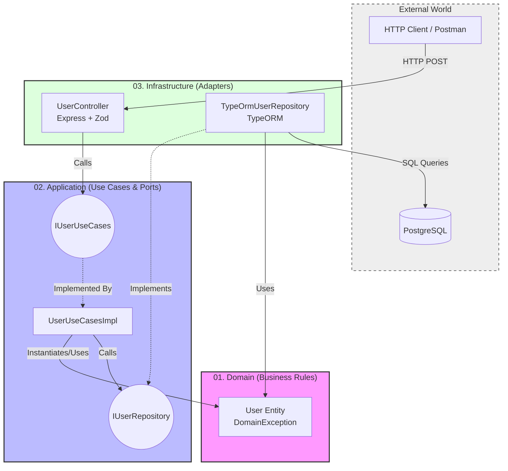

<div align="center">
  <h1>Hexagonal Architecture Node Study</h1>
  <p>A robust, scalable, and strictly decoupled REST API built with Node.js to study and apply the Hexagonal Architecture (Ports and Adapters) pattern.</p>
</div>

<br />

## 🚀 Technologies Used

- **Runtime:** Node.js
- **Language:** TypeScript
- **Web Framework:** Express (v4.x)
- **Database:** PostgreSQL (v15)
- **ORM:** TypeORM (v0.3.x)
- **Validation:** Zod (v3.x)
- **Containerization:** Docker & Docker Compose

## 🏗️ Architecture Overview

Hexagonal Architecture aims to isolate pure business logic from all technologies and delivery mechanisms. It adheres to the "Dependency Rule": dependencies must always point inward (towards the domain).

### Layers (Inside-Out)

1. **`01_Domain_EnterpriseBusinessRules`**: The core of the application. Contains Entities and Business Rules. It knows nothing about frameworks, HTTP, or Databases.
2. **`02_Application_UseCasesAndPorts`**: Contains specific Use Case logic. This layer defines "Ports" (Interfaces):
   - **In Ports:** How the outside world interacts with the Domain.
   - **Out Ports:** What the Application needs from the outside world (e.g., storing data) without knowing the implementation details.
3. **`03_Infrastructure_AdaptersAndFrameworks`**: Concrete implementations.
   - **In Adapters:** Express Controllers that receive JSON, validate it (using Zod), and call the *In Ports*.
   - **Out Adapters:** TypeORM Repositories that implement the *Out Ports*, mapping Domain Entities to Database Entities and communicating with PostgreSQL.
4. **`04_Main_DependencyInjectionAndSetup`**: The "Composition Root". Assembles all components by instantiating concrete adapters and injecting them into the use cases.

### Architecture Diagram



## 🔌 API Endpoints

| Method | Endpoint | Description | Request Body |
|--------|----------|-------------|--------------|
| `POST` | `/users` | Create a new user | `{ "name": "string", "email": "string", "age": number }` |
| `GET`  | `/users` | Get all users | - |
| `GET`  | `/users/:id` | Get user by ID | - |
| `PUT`  | `/users/:id` | Update user | `{ "name": "string", "age": number }` |
| `DELETE` | `/users/:id` | Delete user | - |

## 🛠️ Installation & Setup

### Prerequisites
- [Node.js](https://nodejs.org/) (v18+ recommended)
- [Docker Desktop](https://www.docker.com/products/docker-desktop)

### Steps

1. **Clone the repository**
   ```bash
   git clone https://github.com/MNATorres/hexagonal-architecture-node-study.git
   cd hexagonal-architecture-node-study
   ```

2. **Start the Infrastructure (PostgreSQL & pgAdmin)**
   ```bash
   docker-compose up -d
   ```
   > *pgAdmin will be available at `http://localhost:5050` (Login: `admin@admin.com` / Password: `admin`)*

3. **Install Dependencies**
   ```bash
   npm install
   ```

4. **Run the Application (Development Mode)**
   ```bash
   npm run dev
   ```
   > *The API will be available at `http://localhost:3000`*

## 🧑‍💻 Useful Commands

- `npm run dev`: Starts the server with Nodemon and `ts-node`.
- `npx tsc --noEmit`: Type-checks the project without compiling output.
- `docker-compose up -d`: Starts the background services (DB, GUI).
- `docker-compose down`: Stops and removes the background containers.
