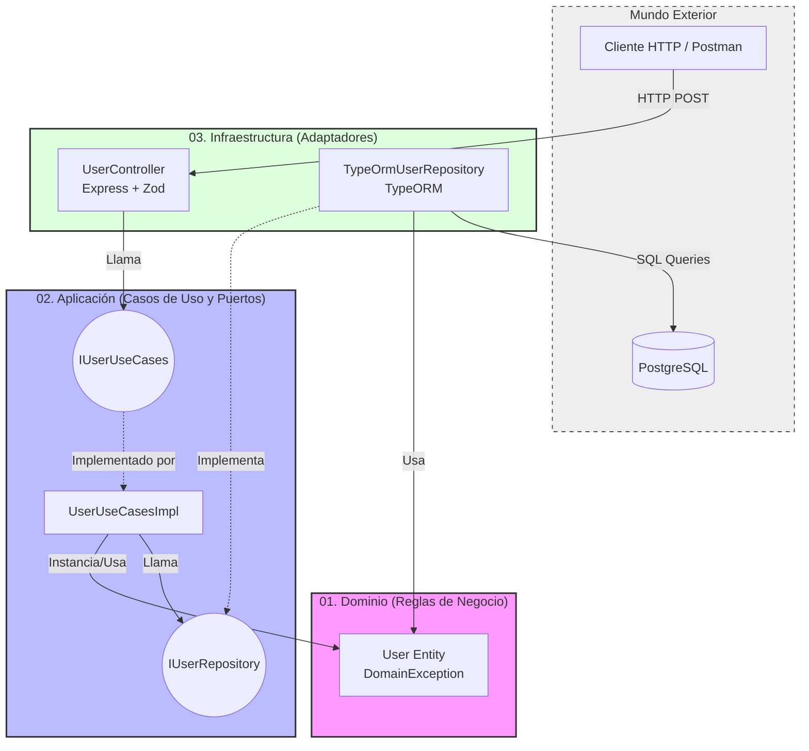

# Hexagonal Architecture Node Study

Este proyecto es un entorno de estudio diseñado para implementar estrictamente los conceptos de la **Arquitectura Hexagonal** (Puertos y Adaptadores) usando **Node.js, TypeScript, Express, TypeORM y PostgreSQL**.

## Teoría: Arquitectura Hexagonal

La arquitectura hexagonal busca aislar la lógica de negocio pura de todas las tecnologías y mecanismos de entrega. Esto se logra gracias a la "Regla de Dependencia": las dependencias siempre deben apuntar hacia adentro (hacia el dominio).

### Capas (De Adentro hacia Afuera)

1. **01_Domain_EnterpriseBusinessRules**: La esencia pura de la aplicación. Aquí viven las Entidades y las Reglas de Negocio. No conoce nada sobre frameworks, HTTP o Bases de Datos.
2. **02_Application_UseCasesAndPorts**: Contiene la lógica específica de los Casos de Uso. Esta capa define "Puertos" (Interfaces):
   - **In Ports:** Cómo el mundo exterior puede interactuar con el Dominio.
   - **Out Ports:** Qué necesita la Aplicación del mundo exterior (ej. guardar datos, enviar emails) sin saber cómo se implementa.
3. **03_Infrastructure_AdaptersAndFrameworks**: Implementaciones concretas. 
   - **In Adapters:** Controladores Express que reciben JSON, lo validan (con Zod) y llaman a los *In Ports*.
   - **Out Adapters:** Repositorios TypeORM que implementan los *Out Ports*, traduciendo entidades de dominio a entidades de Base de Datos y hablando con PostgreSQL.
4. **04_Main_DependencyInjectionAndSetup**: Ensambla todas las piezas. Es el "Composition Root" donde se instancian los adaptadores concretos y se inyectan en los casos de uso.

## Diagrama de la Arquitectura



## Ejecución con Docker

```bash
# 1. Levantar la base de datos PostgreSQL y pgAdmin
docker-compose up -d

# 2. Instalar dependencias
npm install

# 3. Arrancar en modo desarrollo
npm run dev
```

pgAdmin está disponible en `http://localhost:5050` (admin@admin.com / admin).
La API está disponible en `http://localhost:3000`.
